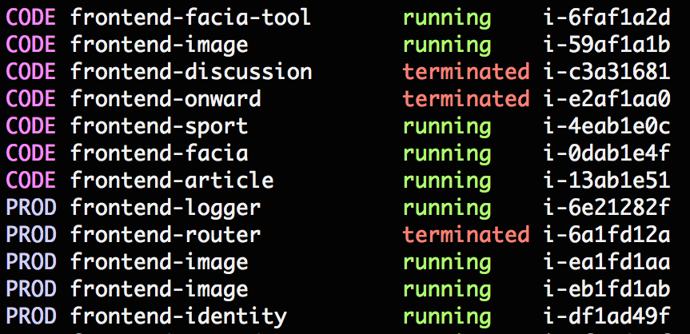

Goo tool
========

[ ](https://bintray.com/guardian/frontend/frontend-goo-tool/_latestVersion)

Deploy, scale, and cloudform, all in one command!

Setup
-----

1. AWS config

    Create a file called `~/.aws/config` with this content:

    ```
    [profile frontend]
    region = eu-west-1
    ```

2. Riffraff key

    Make a riffraff key [here](https://riffraff.gutools.co.uk/apiKeys/list)
    Put the key in `~/.riffraff`.

    ```
    _YOUR_KEY_
    ```

3. Janus access
    Ask your team to add you to the Frontend project in [janus](https://janus.gutools.co.uk).

## Using the tool

### Preparation

1. get [janus](https://janus.gutools.co.uk) credentials for "frontend"
1. cd to the "platform" directory in your terminal

### Deploy
* `./goo deploy --code -b <build_number>`
* `./goo deploy --prod -b <build_number>`

The `-b` parameter is optional - if you want the latest build, omit it

## More detailed help on commands

###Version

Check which version of goo you are using.

`./goo version` returns:

    Goo version: 0.X

###Groups

These subcommands are for working with Amazon autoscaling groups.

####`groups list`

List all the EC2 autoscaling groups.

`./goo groups list` returns:

    frontend-CODE-AdminAutoscalingGroup-XXXX               1/1/2
    frontend-CODE-ApplicationsAutoscalingGroup-XXXX        1/1/2
    frontend-CODE-ArchiveAutoscalingGroup-XXXX             1/1/2
    ...

####`groups list <grep_pattern>`

List further detail about the matching EC2 autoscaling groups.

`./goo groups list admin` returns:

    frontend-CODE-AdminAutoscalingGroup-XXXX                
      Load Balancers: [frontend-AdminLoa-XXXX]
      Min/Desired/Max = 1/1/2
    
      i-3739ee74 Healthy/Terminating
      i-37ad1875 Healthy/InService
    
    frontend-PROD-AdminAutoscalingGroup-XXXX                
      Load Balancers: [frontend-AdminLoa-XXXX]
      Min/Desired/Max = 1/1/2
    
      i-07a51045 Healthy/InService

`./goo groups list code-admin` returns:

    frontend-CODE-AdminAutoscalingGroup-XXXX                
      Load Balancers: [frontend-AdminLoa-XXXX]
      Min/Desired/Max = 1/1/2
    
      i-3739ee74 Healthy/Terminating
      i-37ad1875 Healthy/InService 

####`groups update <autoscaling_group> <min> <desired> <max>`

Update the named EC2 autoscaling group with the provided instance parameters.
  
`./goo groups update frontend-CODE-AdminAutoscalingGroup-XXXX 1 1 2` returns:

    Updated autoscaling group

###EC2

There is currently only one subcommand for checking EC2 instances.

####`ec2 list`

List all known EC2 instances.

`./goo ec2 list` returns:



###Deploy

Initiate riff-raff deployments for a given staging environment.

####`deploy list`

Lists all the applications that this tool is configured to deploy. The list contains aliases that can be used in deploy command. 

`./goo deploy list` returns:

    article
    facia
    applications
    sport
    identity
    admin
    facia-tool
    discussion
    onward
    diagnostics
    commercial

####`deploy`

Deploys frontend projects to a given environment. The subcommand uses riff-raff aliases, so for 
instance: `deploy article` will deploy `frontend-article`, and similarly for the other frontend applications.

The `deploy` command takes the following options:

* `--prod`: Deploy to production.
* `--code`: Deploy to code.
* `--name STRING`: Name of the application you want to deploy, or a comma separated list of apps. Default to all apps.
* `--build BUILDID` or `-b BUILDID`: teamcity build number to deploy

`./goo deploy --code` returns:

    Deploying article - http://riffraff.gutools.co.uk/deployment/view/c7eacaa1-e46b-4b27-9036-ad81f10af020
    Deploying facia - http://riffraff.gutools.co.uk/deployment/view/46b57358-4d6c-41b5-924e-b970eeed1684
    Deploying applications - http://riffraff.gutools.co.uk/deployment/view/392a8091-3bc8-405d-ae08-6fac55fc5925
    Deploying sport - http://riffraff.gutools.co.uk/deployment/view/1ea521a3-8c3a-4ddc-a9bc-420e92396d4e
    Deploying identity - http://riffraff.gutools.co.uk/deployment/view/4a7e4927-d891-4ca1-b3aa-31571f8d0265
    Deploying admin - http://riffraff.gutools.co.uk/deployment/view/8d351d0f-e7af-4605-a01c-cc4c407f5131
    Deploying facia-tool - http://riffraff.gutools.co.uk/deployment/view/68888d5d-b5e7-47ed-90a8-1160577f37a1
    Deploying discussion - http://riffraff.gutools.co.uk/deployment/view/7658b19a-7618-4715-9e46-852a79e51b8a
    Deploying onward - http://riffraff.gutools.co.uk/deployment/view/9cc85a36-7909-4f64-b2c1-9989094f61b9
    Deploying diagnostics - http://riffraff.gutools.co.uk/deployment/view/c5871a05-a205-4eef-9b04-dc6d7ac16d7c
    Deploying commercial - http://riffraff.gutools.co.uk/deployment/view/62c7e4bd-f27d-4874-be7c-4dd9b9f77c3f

`./goo deploy --code --name admin` returns:

    Deploying admin - http://riffraff.gutools.co.uk/deployment/view/6b6592dc-f487-46a1-a340-b61258e980cd

`./goo deploy --code --name article,onward` returns:

    Deploying article - http://riffraff.gutools.co.uk/deployment/view/e58d7c43-96b0-4b7b-b217-81b7ba2aef1f
    Deploying onward - http://riffraff.gutools.co.uk/deployment/view/d2402528-d8dc-404a-bc09-6310b98442cf

####`deploy block|unblock`

Block or unblock deploys to production.

###Cloudformation

####`cloudformation up`

Creates a new stack with the given environment. Yaml or Json files are accepted.

`./goo cloudformation up --code frontend-logger` returns:

    Uploaded template from: /platform/cloudformation/frontend-logger.yaml
    Create Stack Request sent successfully.

####`cloudformation update`

Updates an existing cloudformation stack. Do check the [AWS documentation](http://docs.aws.amazon.com/AWSCloudFormation/latest/UserGuide/using-cfn-updating-stacks.html)
concerning resource updates. Yaml or Json files are accepted.

`./goo cloudformation update --code frontend` returns:
    
    Uploaded template from: /platform/cloudformation/frontend.yaml
    Update Stack Request sent successfully.
    
####`cloudformation destroy`

Destroys an existing stack.

`./goo cloudformation destroy --code frontend-logger` returns:

    Delete Stack Request sent successfully.

For safety reasons, the tool does not permit deletion of PROD stacks. Please do so manually.
    
`./goo cloudformation destroy --prod frontend-logger` returns:

    Can not delete PROD stacks

###Fastly

####`fastly logs`

Downloads the fastly logs to a local directory. You can optionally define a service, like 'beta.theguardian.com'. The default service is 'www.theguardian.com'.

`./goo fastly logs 2014-11-02T18:1 Downloads/logs beta.theguardian.com` returns:

    Downloading fastly/beta.theguardian.com/2014-11-02T18:37:00.000-ghfSz8LOa6_R_0IAAAAA.log

####`fastly ls`

Lists the fastly logs that have been streamed to the s3 bucket. Again, the default service is 'www.theguardian.com'.

`./goo fastly ls` returns:

    fastly/www.theguardian.com/2014-11-02T19:00:00.000-FOra6ZvOWCaT1BIAAAAA.log
    fastly/www.theguardian.com/2014-11-02T19:00:00.000-RyJanKHsmK7mGhIAAAAA.log
    ...

###Cloudwatch

####`cloudwatch logs download`

Downloads cloudwatch logs to a local directory.

logs download \<log-group\> \<start-time\> \<end-time\> \[output-dir\]

For example:  
`./goo cloudwatch logs download PROD-admin 2015-05-05T14:15 2015-05-05T14:22`  
returns a directory of downloaded logs:

    awslogs.PROD-admin.2015-05-05T14-15-to-2015-05-05T14-22  
    
The directory will contain a log file for each log stream having events during that period.  
If the `output-dir` argument is not specified, the output directory will be written to the current working directory.


Why is running goo so slow?
---------------------------

Historically, the platform tool was manually updated. This led to developers using different versions, or getting in trouble 
with some external package dependencies. Goo seeks to auto-update dependencies on startup, using sbt.

A simple way to workaround the slow startup is to skip sbt, and the dependency update. This means the user is responsible
for keeping the package up-to-date. It's simple to do:

1. Run sbt, and then `project goo-client` from the sbt prompt.
2. Run `dist`, which will create a standalone Java application.
3. Use the generated bash script [goo-client](client/target/universal/stage/bin/goo-client) to execute commands, eg. `./goo-client groups list`

Development
-----------

Developers can publish new versions of goo using our maven repo, and users receive 
updates the next time they use the tool.

The tool is made up of three parts:

1. a bash script [goo](../goo), which executes
2. an sbt project `goo-client`, which is a bootstrap loader for
3. a maven-hosted library `frontend-goo-tool`

This convoluted approach enables users to invoke the bash script simply with parameters, whilst maven's project versioning is given the task of resolving the latest published version of the goo tool.

Developers can run sbt using the supplied [sbt script](sbt). From here, the `dev-build` project can be used for development.

For testing, developers can use the `dev-build` sbt project to invoke tasks in a similar manner to the [goo](../goo) script.
In sbt, `dev-build` can be executed using `run ec2 list`, for example.  
 
Publishing
----------

Register and configure bintray if you haven't done so, and make sure you're a part of the [guardian](https://bintray.com/guardian/) organization.

To configure bintray, start sbt and run `bintrayChangeCredentials`.

1. `cd goo.d`
2. `git commit` all your changes
3. `git tag` the version you're publishing
4. `git push` your branch to the server. [`git push --follow-tags` will push tags as well as commits.]
5. Start sbt and type `project frontend-goo-tool`, and then `publish` (you must have reloaded sbt since configuring bintray)
